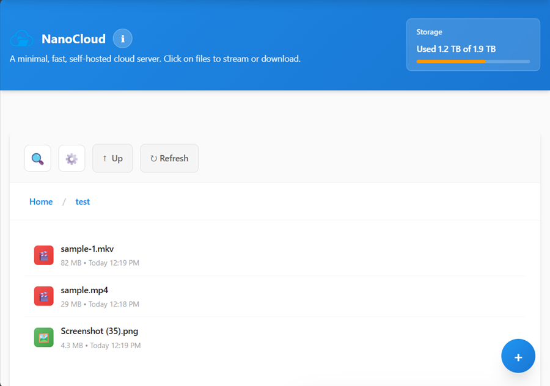
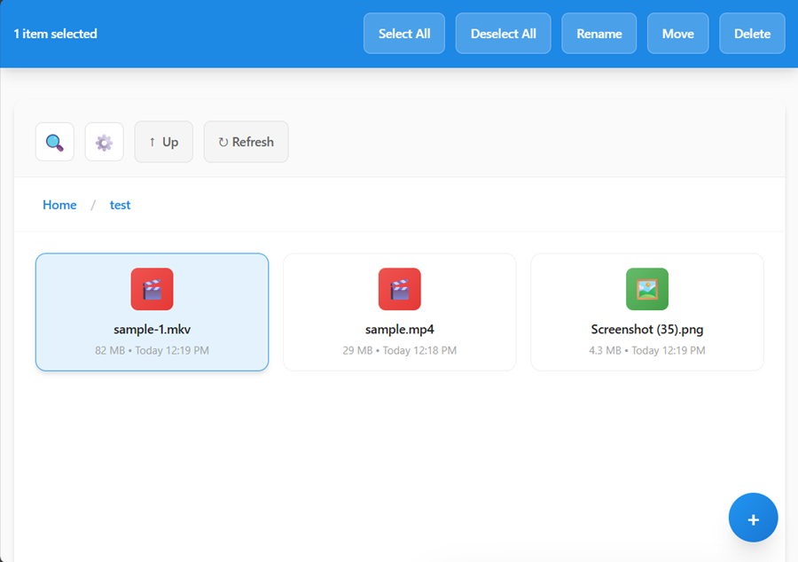
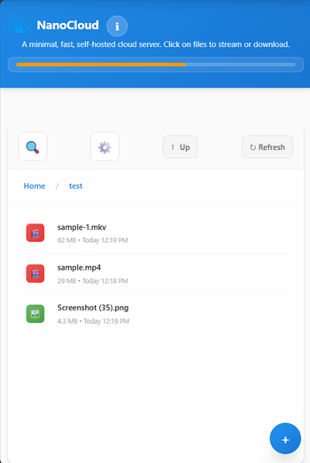

# NanoCloud

A minimal, fast, self-hosted cloud storage server with a modern, responsive interface. Upload, organize, and access your files from anywhere with an elegant web interface.


## 🚀 Overview

NanoCloud was born out of a personal need for a lightweight, high-performance file management solution. It serves two primary purposes:

### 📂 Network Dropbox
A minimal, self-hosted alternative to Google Drive, OneDrive, or Dropbox.
* **Localized Speed:** Utilize the full bandwidth of your LAN for uploads and downloads, completely bypassing your ISP.
* **Universal Access:** Files uploaded from one device are immediately available to stream or download from any other device on your network.
* **No External Dependencies:** Your data stays within your local environment, ensuring privacy and high-speed performance.

### 📸 Seamless File Sharing
Designed to solve the "How do I send you these photos?" problem.
* **Guest-Friendly:** A dead-simple interface that allows non-technical guests to share or receive files without needing accounts or complex setups.
* **Zero Friction:** Perfect for quick transfers of photos and videos during gatherings or events.

## ⚠️ Security & Caution

> [!IMPORTANT]
> **This application is designed for trusted private networks only.**

* **Trust Model:** This tool operates on the assumption that all users on your local network are trusted. **No native authentication or user access control is implemented.**
* **Deployment:** **Do not deploy this on a publicly accessible server/internet.** Anyone with the URL will have at least read access to your files.
* **Hardening:** If you require security, you can implement authentication (such as Basic Auth or Authelia) via your web server (Nginx, Apache, Caddy, etc.) acting as a reverse proxy.

## 📸 Screenshots

### Desktop Interface

*List view with file information and operations*


*Grid view for visual browsing*

### Mobile Interface

*Touch-optimized file browser with responsive design*

## ✨ Features

- **📁 File Management**: Upload, download, rename, move, and delete files and folders
- **🗂️ Directory Navigation**: Browse nested directories with breadcrumb navigation
- **🔍 Advanced Search**: Quick search in current folder or deep recursive search across all subfolders
- **🔄 Client-Side Sorting**: Sort by name, date, or size (ascending/descending) - all in browser
- **📊 Storage Monitoring**: Real-time storage usage visualization
- **🎨 Modern UI**: Clean, responsive design with grid and list view modes
- **📱 Mobile Optimized**: Touch-friendly interface with press-and-hold selection
- **⚡ Fast Performance**: Optimized for speed with concurrent uploads
- **🔒 Secure**: Path traversal protection and input sanitization
- **🎯 Multi-Select**: Select multiple items for batch operations (works in search results too!)
- **⌨️ Keyboard Shortcuts**: Efficient navigation with keyboard commands
- **🎬 Media Streaming**: Stream videos, audio, and view images directly in browser
- **📦 Drag & Drop**: Upload files and folders by dragging them anywhere on the page
- **🔄 Self-Update**: Built-in update system to keep your installation current
- **♻️ Resumable Uploads**: Chunked uploads with cross-device resume capability for unlimited file sizes

## 📋 Requirements

- **PHP 8.0+** with extensions:
  - `fileinfo` (for MIME type detection)
  - `json` (for API responses)
  - `PharData` (for self-update system)
- **Web Server**: Apache, Nginx, Lighttpd, or any PHP-compatible server
- **Storage**: Sufficient disk space for your files
- **rsync**: For atomic updates (usually pre-installed on Linux)

## 🚀 Quick Start

### 1. Download & Extract
```bash
git clone https://github.com/souvikranju/nanocloud.git
cd nanocloud
```

### 2. Configure Web Server
Configure your web server to point to the installation directory:

```apache
# Apache
DocumentRoot /path/to/nanocloud
```

```nginx
# Nginx
root /path/to/nanocloud;
```

> 📖 **Detailed setup instructions:** See [Quick Start Guide](docs/QUICK_START.md)

### 3. Configure NanoCloud
```bash
cp config/local.php.example config/local.php
nano config/local.php  # Edit your settings
```

### 4. Set Permissions
```bash
chmod 755 storage
chown www-data:www-data storage
```

### 5. Access
Open your browser and navigate to your server URL.

## 📁 Project Structure

```
nanocloud/
├── public/                      # Web root (ONLY this is publicly accessible)
│   ├── index.php               # Main HTML page
│   ├── api.php                 # API router
│   ├── download.php            # Download handler
│   ├── update_api.php          # Update system API
│   └── assets/                 # Frontend assets (CSS, JS, images)
│
├── src/                        # Application source (NOT web-accessible)
│   ├── autoload.php           # PSR-4 autoloader
│   ├── Core/                  # Core classes (Config, Request, Response)
│   ├── Services/              # Business logic layer
│   ├── Security/              # Security classes
│   └── Helpers/               # Utility functions
│
├── config/                     # Configuration files
│   ├── defaults.php           # Default configuration
│   ├── local.php.example      # Example local config
│   └── local.php              # Local overrides (gitignored)
│
├── storage/                    # File storage directory
│   └── .temp/                 # Temporary upload staging
│
└── docs/                       # Documentation
```

## ⚙️ Configuration

NanoCloud uses a flexible configuration system. Create `config/local.php` to customize:

```php
<?php
// Storage location
$STORAGE_ROOT = '/path/to/storage';

// Download rate limiting
$DOWNLOAD_RATE_LIMIT_MB = 10; // MB/s (0 = unlimited)

// File permissions
$DIR_PERMISSIONS = 0755;
$FILE_PERMISSIONS = 0644;

// Chunked upload configuration
$CHUNK_TEMP_DIR = sys_get_temp_dir() . '/nanocloud-chunks';
$CHUNK_STALE_HOURS = 2; // Hours to keep incomplete uploads

// Operation control
$READ_ONLY = false;
$UPLOAD_ENABLED = true;
$DELETE_ENABLED = true;
$RENAME_ENABLED = true;
$MOVE_ENABLED = true;
```

### Chunked Uploads

NanoCloud automatically uses chunked uploads for files larger than 2MB, enabling:
- **Unlimited file sizes** (bypasses PHP upload limits)
- **Resumable uploads** across devices and sessions
- **Automatic retry** on network failures
- **Cross-device resume** - start on desktop, continue on mobile

**Configuration:**
- `CHUNK_TEMP_DIR`: Where to store temporary chunks (default: system temp)
- `CHUNK_STALE_HOURS`: Hours to keep incomplete uploads (default: 2)

> 📖 **Chunked upload details:** See [Chunked Upload Guide](docs/CHUNKED_UPLOAD.md)

> 📖 **Full configuration options:** See [Configuration Guide](docs/CONFIGURATION.md)

## 🎮 Usage

### Keyboard Shortcuts

| Shortcut | Action |
|----------|--------|
| `Ctrl/Cmd + U` | Open upload modal |
| `Ctrl/Cmd + A` | Select all items |
| `Ctrl/Cmd + Click` | Multi-select items |
| `F5` or `Ctrl/Cmd + R` | Refresh listing |
| `Delete` or `Backspace` | Delete selected items |
| `F2` | Rename selected item |
| `Escape` | Deselect all / Close modals |
| `F1` | Open user guide |

### Touch Gestures

- **Tap**: Open file or folder
- **Press & Hold (500ms)**: Select item (with haptic feedback)
- **Tap after selection**: Add more items to selection
- **Drag & Drop**: Upload files anywhere on the page

### File Operations

1. **Upload**: Click `+` button, drag & drop, or use `Ctrl/Cmd + U`
2. **Navigate**: Click folders or use breadcrumbs
3. **Search**: Use search box for current folder or click "Search Subfolders" for deep search
4. **Sort**: Choose from dropdown (Name, Date, Size)
5. **Multi-Select**: `Ctrl/Cmd + Click` or use "Select All"
6. **Batch Operations**: Select multiple items, then use action buttons

## 🏗️ Architecture

NanoCloud follows modern software architecture principles with clean separation of concerns:

### Backend Architecture

**Request Flow:**
```
Browser → public/api.php → Security Layer → Service Layer → Response
```

**Key Components:**

- **Core Layer**: Configuration, Request/Response handling
- **Security Layer**: Path validation, input sanitization
- **Service Layer**: Business logic (Directory, File, Upload, Storage services)
- **Helpers**: Shared utility functions

> 📖 **Technical details:** See [Architecture Guide](docs/ARCHITECTURE.md)

## 📚 Documentation

- **[Quick Start Guide](docs/QUICK_START.md)** - Fast installation and setup
- **[Configuration Guide](docs/CONFIGURATION.md)** - Detailed configuration options
- **[API Documentation](docs/API.md)** - Complete API reference
- **[Security Guide](docs/SECURITY.md)** - Security best practices and hardening
- **[Architecture Guide](docs/ARCHITECTURE.md)** - Technical architecture details
- **[Chunked Upload Guide](docs/CHUNKED_UPLOAD.md)** - Chunked upload implementation
- **[Update System](docs/UPDATES.md)** - Self-update documentation
- **[Troubleshooting](docs/TROUBLESHOOTING.md)** - Common issues and solutions

## 📱 Browser Support

- Chrome/Edge 90+
- Firefox 88+
- Safari 14+
- Mobile browsers (iOS Safari, Chrome Mobile)

## 🤝 Contributing

Contributions are welcome! Here's how you can help:

1. **Report Bugs**: Open an issue with details
2. **Suggest Features**: Share your ideas
3. **Submit Pull Requests**: Fork, create a branch, and submit a PR
4. **Improve Documentation**: Help make docs clearer

Please follow the existing code style and include tests where applicable.

## 📄 License

MIT License - Feel free to use and modify for your needs.

## 📧 Support

- **Issues**: [GitHub Issues](https://github.com/souvikranju/nanocloud/issues)
- **Discussions**: [GitHub Discussions](https://github.com/souvikranju/nanocloud/discussions)
- **Documentation**: [docs/](docs/)

## 🙏 Acknowledgments

Built with ❤️ for the self-hosting community.

---

**NanoCloud** - Simple, fast, self-hosted cloud storage.
