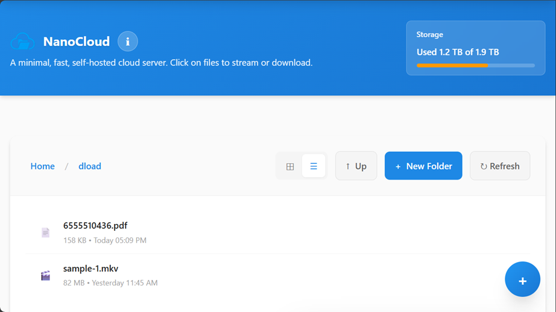

# NanoCloud

A minimal, fast, self-hosted cloud storage server with a modern, responsive interface. Upload, organize, and access your files from anywhere with an elegant web interface.

## 🚀 Overview

This project was born out of a personal need for a lightweight, high-performance file management solution. It serves two primary purposes:

### 📂 Network Dropbox
A minimal, self-hosted alternative to Google Drive, OneDrive, or Dropbox.
* **Localized Speed:** Utilize the full bandwidth of your LAN for uploads and downloads, completely bypassing your ISP.
* **Universal Access:** Files uploaded from one device are immediately available to stream or download from any other device on your network.
* **No External Dependencies:** Your data stays within your local environment, ensuring privacy and high-speed performance.

### 📸 Seamless File Sharing
Designed to solve the "How do I send you these photos?" problem.
* **Guest-Friendly:** A dead-simple interface that allows non-technical guests to share or receive files without needing accounts or complex setups.
* **Zero Friction:** Perfect for quick transfers of photos and videos during gatherings or events.

## ⚠️ Security & Caution

> [!IMPORTANT]
> **This application is designed for trusted private networks only.**

* **Trust Model:** This tool operates on the assumption that all users on your local network are trusted. **No native authentication or user access control is implemented.**
* **Deployment:** **Do not deploy this on a publicly accessible server/internet.** Anyone with the URL will have full access to your files.
* **Hardening:** If you require security, you can implement authentication (such as Basic Auth or Authelia) via your web server (Nginx, Apache, Caddy, etc.) acting as a reverse proxy.

## 📸 Screenshots

### Desktop Interface

*List view with file information*

### Mobile Interface


*Touch-optimized file browser with responsive design*

## 🚀 Features

- **📁 File Management**: Upload, download, rename, move, and delete files and folders
- **🗂️ Directory Navigation**: Browse nested directories with breadcrumb navigation
- **🔍 Advanced Search**: Quick search in current folder or deep recursive search across all subfolders
- **🔄 Client-Side Sorting**: Sort by name, date, or size (ascending/descending) - all in browser
- **📊 Storage Monitoring**: Real-time storage usage visualization
- **🎨 Modern UI**: Clean, responsive design with grid and list view modes
- **📱 Mobile Optimized**: Touch-friendly interface with press-and-hold selection
- **⚡ Fast Performance**: Optimized for speed with concurrent uploads
- **🔒 Secure**: Path traversal protection and input sanitization
- **🎯 Multi-Select**: Select multiple items for batch operations (works in search results too!)
- **⌨️ Keyboard Shortcuts**: Efficient navigation with keyboard commands
- **🎬 Media Streaming**: Stream videos, audio, and view images directly in browser
- **📦 Drag & Drop**: Upload files and folders by dragging them anywhere on the page

## 📋 Requirements
No frameworks, heavy tools - just **Pure HTML/JS/CSS**

- **PHP 7.4+** with extensions:
  - `fileinfo` (for MIME type detection)
  - `json` (for API responses)
- **Web Server**: Apache, Nginx, or any PHP-compatible server
- **Storage**: Sufficient disk space for your files

## 🛠️ Installation

1. **Clone or download** this repository to your web server directory:
   ```bash
   git clone https://github.com/yourusername/nanocloud.git
   cd nanocloud
   ```

2. **Configure PHP settings** in `php.ini`:
   ```ini
   file_uploads = On
   upload_max_filesize = 2G # As required
   post_max_size = 2G # As required
   max_file_uploads = 50
   ```

3. **Configure NanoCloud**:
   
   See the [Configuration System](#configuration-system)

4. **Set permissions**:
   ```bash
   chmod 755 /path/to/your/storage
   chown www-data:www-data /path/to/your/storage
   ```

5. **Access** via web browser:
   ```
   http://your-server/nanocloud/
   ```

## 📁 Project Structure

```
nanocloud/
├── config.php                # Configuration and constants
├── config.defaults.php       # Default configuration values
├── config.local.php          # Local overrides (not tracked)
├── config.local.php.example  # Example local configuration
├── index.php                 # Main HTML interface
├── nanocloud_api.php         # REST API endpoints
├── nanocloud_download.php    # File download handler
├── nanocloud_lib.php         # Shared utility functions
├── nanocloud_update_api.php  # Self-update system API
├── version.json              # Current version information
├── README.md                 # This file
│
├── .temp/                    # Temporary files (auto-created)
│   ├── backup/               # Backup archives for rollback
│   ├── update_download/      # Downloaded update packages
│   └── update_staging/       # Staged updates before deployment
│
├── assets/
│   ├── css/                  # Modular CSS architecture
│   │   ├── variables.css     # Design system variables
│   │   ├── base.css          # Reset and base styles
│   │   ├── layout.css        # Layout components
│   │   ├── components.css    # UI components
│   │   ├── utilities.css     # Utility classes
│   │   └── responsive.css    # Mobile responsiveness
│   │
│   └── js/                   # Modular JavaScript
│       ├── constants.js      # Application constants
│       ├── main.js           # Application entry point
│       ├── nanocloudClient.js # API client
│       ├── state.js          # State management
│       ├── updateChecker.js  # Update notification system
│       ├── uploader.js       # Upload orchestration
│       ├── utils.js          # Utility functions
│       │
│       └── ui/               # UI modules
│           ├── fileIcons.js      # File type icons
│           ├── filterSort.js     # Search and sorting system
│           ├── itemActions.js    # Item operations
│           ├── keyboardShortcuts.js # Keyboard handling
│           ├── list.js           # File list rendering
│           ├── progress.js       # Upload progress
│           ├── selection.js      # Multi-select system
│           ├── toast.js          # Notifications
│           └── touchHandlers.js  # Touch interactions
```

## 🔄 Self-Update System

NanoCloud includes a built-in self-update mechanism that allows you to update to the latest version directly from the web interface.

### Update Requirements

- **PHP Extensions**: `PharData` for archive handling
- **Write Permissions**: Web server must have write access to installation directory
- **rsync**: Required for atomic deployment (usually pre-installed on Linux)
- **Internet Access**: To fetch updates from GitHub

### Troubleshooting Updates

**Permission errors:**
```bash
# Grant write permissions to web server
sudo chown -R www-data:www-data /path/to/nanocloud
sudo chmod -R 755 /path/to/nanocloud
```

**Update stuck:**
- Stale locks auto-cleanup after 10 minutes
- Manually remove `.temp/update.lock` if needed

**Rollback fails:**
- Ensure backup exists in `.temp/backup/`
- Check write permissions
- Manually extract backup if needed

## 🎯 Architecture

### Backend (PHP)

**Key Features:**
- Path traversal protection
- Input sanitization
- Transactional uploads with rollback
- Session-based upload limits
- Recursive directory operations
- Storage metrics calculation

### Frontend (JavaScript)

**ES6 Modules:**
- State management with reactive updates
- Event-driven architecture
- Optimized rendering with debouncing

**UI Components:**
- Grid and list view modes
- Multi-select with keyboard/touch support
- Real-time upload progress
- Toast notifications
- Modal dialogs
- Breadcrumb navigation

### Styling (CSS)

**Modular CSS Architecture:**
- `variables.css` - Design tokens and CSS custom properties
- `base.css` - Reset and typography
- `layout.css` - Page structure and containers
- `components.css` - Reusable UI components
- `utilities.css` - Helper classes and animations
- `responsive.css` - Mobile-first responsive design

## ⚙️ Configuration

### Configuration System

NanoCloud uses a flexible configuration system that preserves your custom settings during upgrades:

**Files:**
- `config.defaults.php` - Default settings
- `config.php` - Configuration loader
- `config.local.php` - Your custom settings (NOT tracked by git, preserved during upgrades)
- `config.local.php.example` - Example configuration with all available options

**Setup:**

   ```bash
   # Copy the example file
   cp config.local.php.example config.local.php
   
   # Edit with your settings
   nano config.local.php
   ```

### Available Settings

Edit `config.local.php` to customize these settings:

#### Storage Configuration
```php
// Storage root directory (absolute path)
$STORAGE_ROOT = '/path/to/your/storage';
```

#### Upload Limits
```php
// User-defined maximum file size in bytes
$user_defined_max = 5368709120; // 5GB

// Maximum session size in bytes
$MAX_SESSION_BYTES = 5368709120; // 5GB
```

#### Download Settings
```php
// Download rate limit in MB/s (0 = unlimited)
$DOWNLOAD_RATE_LIMIT_MB = 10;
```

#### File Permissions
```php
// Directory permissions (octal notation)
$DIR_PERMISSIONS = 0755; // rwxr-xr-x

// File permissions (octal notation)
$FILE_PERMISSIONS = 0644; // rw-r--r--
```

#### Ownership (requires appropriate privileges)
```php
// Change owner for uploaded/created files
$FILE_OWNER = 'username';
$FILE_GROUP = 'groupname';
```

#### Operation Control

Control which operations are allowed system-wide. These settings provide granular control over write operations and can be used to implement read-only modes or restrict specific functionality.

```php
// Master read-only switch (highest priority)
// When true, ALL write operations are blocked regardless of other settings
$READ_ONLY = false;

// Individual operation controls (only evaluated when READ_ONLY = false)
$UPLOAD_ENABLED = true;   // Allow file/folder uploads and folder creation
$DELETE_ENABLED = true;   // Allow file/folder deletion
$RENAME_ENABLED = true;   // Allow file/folder renaming
$MOVE_ENABLED = true;     // Allow file/folder moving
```

**Configuration Priority:**
- `READ_ONLY` has the highest priority and overrides all other settings
- When `READ_ONLY = true`, all write operations are blocked regardless of other flags

**UI Behavior:**
- Disabled controls are visually dimmed and show explanatory tooltips
- When `READ_ONLY=true`: Tooltip shows "System is read-only"
- When specific feature disabled: Tooltip shows "[Feature] disabled by administrator"

**Use Cases:**
- **Maintenance Mode**: Set `READ_ONLY = true` to prevent changes during backups or maintenance
- **Archive Mode**: Disable uploads/deletes to preserve historical data while allowing browsing
- **Restricted Access**: Disable specific operations based on deployment requirements
- **Temporary Restrictions**: Quickly disable operations without complex permission systems

### How Configuration Works

1. **Load Defaults**: `config.defaults.php` is loaded first (default configuration)
2. **Apply Overrides**: If `config.local.php` exists, it overrides the defaults

### Frontend Constants (`assets/js/constants.js`)

```javascript
// Upload settings
export const MAX_CONCURRENT_UPLOADS = 3;
export const UPLOAD_PROGRESS_AUTO_HIDE_MS = 5000;

// UI settings
export const REFRESH_DEBOUNCE_MS = 300;
```

## 🎮 Usage

### Keyboard Shortcuts

| Shortcut | Action |
|----------|--------|
| `Ctrl/Cmd + U` | Open upload modal |
| `Ctrl/Cmd + A` | Select all items |
| `Ctrl/Cmd + Click` | Multi-select items |
| `F5` or `Ctrl/Cmd + R` | Refresh listing |
| `Delete` or `Backspace` | Delete selected items |
| `F2` | Rename selected item |
| `Escape` | Deselect all / Close modals |
| `F1` | Open user guide |

### Touch Gestures

- **Tap**: Open file or folder
- **Press & Hold (500ms)**: Select item (with haptic feedback)
- **Tap after selection**: Add more items to selection
- **Drag & Drop**: Upload files anywhere on the page

### Search & Sort

1. **Quick Search** (Current Folder):
   - Type in the search box
   - Results appear after 1-second debounce
   - Searches files and folders in current directory only
   - Case-insensitive partial matching

2. **Deep Search** (Recursive):
   - Click "🔍 Search Subfolders" button
   - Searches all files and folders recursively
   - Shows full path for each result
   - Click breadcrumb paths to navigate to parent folders
   - Click file/folder names to open in new tab

3. **Sorting**:
   - Choose from dropdown: Name (A-Z/Z-A), Date (Newest/Oldest), Size (Largest/Smallest)
   - All sorting happens in browser (no server calls)
   - Folders always appear before files
   - Sort preference saved in browser

4. **Search + Sort**:
   - Sorting works on search results
   - Search persists during auto-refresh
   - Search clears when navigating to different folders

5. **Multi-Select in Search**:
   - Works in both quick and deep search results
   - `Ctrl/Cmd + A` selects all search results
   - Delete and Rename operations available
   - Move disabled in deep search (items in different folders)

### File Operations

1. **Upload Files & Folders**:
   - Click the `+` button (FAB) to select files or folders
   - Drag and drop files or folders anywhere
   - Use `Ctrl/Cmd + U` shortcut
   - Upload disabled during search (clear search first)

2. **Create Folder**:
   - Click "New Folder" button
   - Enter folder name
   - Folder appears in current directory
   - Disabled during search

3. **Navigate**:
   - Click folders to open
   - Use breadcrumbs to jump to parent folders
   - Click "Up" button to go to parent

4. **Multi-Select**:
   - `Ctrl/Cmd + Click` to select multiple items
   - Use "Select All" button
   - Press & hold on touch devices
   - Works in normal view and search results

5. **Batch Operations**:
   - Select multiple items
   - Use selection bar buttons:
     - Rename (single item only)
     - Move to another folder (disabled in deep search)
     - Delete selected items

## 🔒 Security

- **Path Traversal Protection**: All paths validated against storage root
- **Input Sanitization**: Filenames and paths sanitized
- **MIME Type Detection**: Proper content-type headers
- **Session Management**: Upload limits per session
- **Hidden Files**: Dot-prefixed files/folders hidden from listings
- **Transactional Uploads**: Rollback on client disconnect

## 🚀 Performance Optimizations

- **Concurrent Uploads**: Multiple files uploaded in parallel
- **Debounced Refresh**: Prevents excessive API calls
- **Request Tracking**: Prevents duplicate refresh operations
- **Lazy Loading**: Components loaded as needed
- **CSS Variables**: Efficient styling with custom properties
- **Rate Limiting**: Configurable download speed limits
- **Session Write Close**: Non-blocking concurrent requests

## 📱 Browser Support

- Chrome/Edge 90+
- Firefox 88+
- Safari 14+
- Mobile browsers (iOS Safari, Chrome Mobile)

## 🐛 Troubleshooting

### Upload Fails

1. Check PHP settings in `php.ini`:
   - `upload_max_filesize` >= file size
   - `post_max_size` >= `upload_max_filesize`
   - `max_file_uploads` sufficient

2. Verify storage directory permissions:
   ```bash
   ls -la /path/to/storage
   ```

3. Check PHP error logs:
   ```bash
   tail -f /var/log/php-fpm/error.log
   ```

### Permission Errors

- Verify web server user has write access:
  ```bash
  sudo chown -R www-data:www-data /path/to/storage
  sudo chmod -R 755 /path/to/storage
  ```

## 📄 License

MIT License - Feel free to use and modify for your needs.

## 🤝 Contributing

Contributions are welcome! Please feel free to submit a Pull Request.

## 📧 Support

For issues and questions, please open an issue on GitHub.

---

**NanoCloud** - Simple, fast, self-hosted cloud storage.
